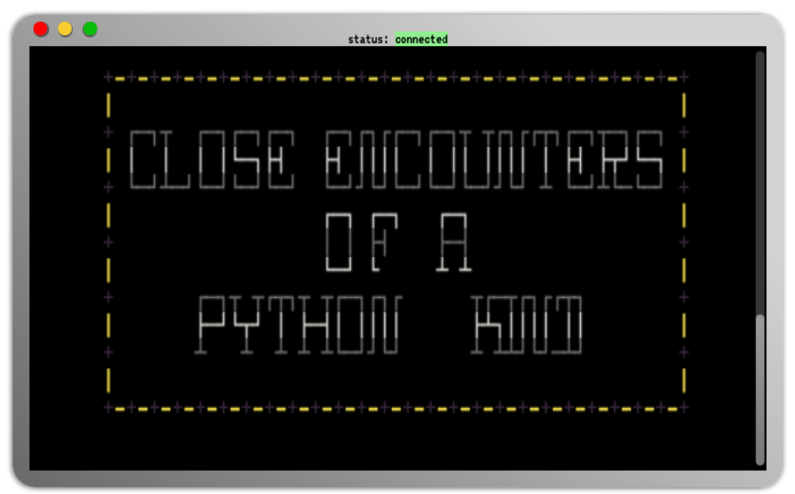

# Close Encounters of a Python Kind

This repository contains the code for a web application which I am hosting on Google App Console. The resulting web app can be reached at [https://alien.njtd.xyz](https://alien.njtd.xyz).

# pyxterm.js
To build this website containing a terminal able to run my python code, I first started by looking at [pyxtermjs](https://github.com/cs01/pyxtermjs) - A fully functional terminal in your browser - and adapted it to suit my needs.

## From this...


## To this...


## Installation

### Clone & Run Locally
This code is able to be run locally if you want to use it to host your own web app featuring python code that you want to be displayed in a 'terminal'.
Simply follow the steps below and edit the appropriate files to include your own code.

Clone this repository, enter the newly created directory.
```
> git clone https://github.com/NathanJohnNJ/alien.git
> cd alien
```

Create and activate a new virtual environment.

```
> python3 -m venv .env
> source .env/bin/activate
```

From within the virtual environment, run the following:

```
> python3 -m pip install -r requirements.txt
> python3 main.py
```

